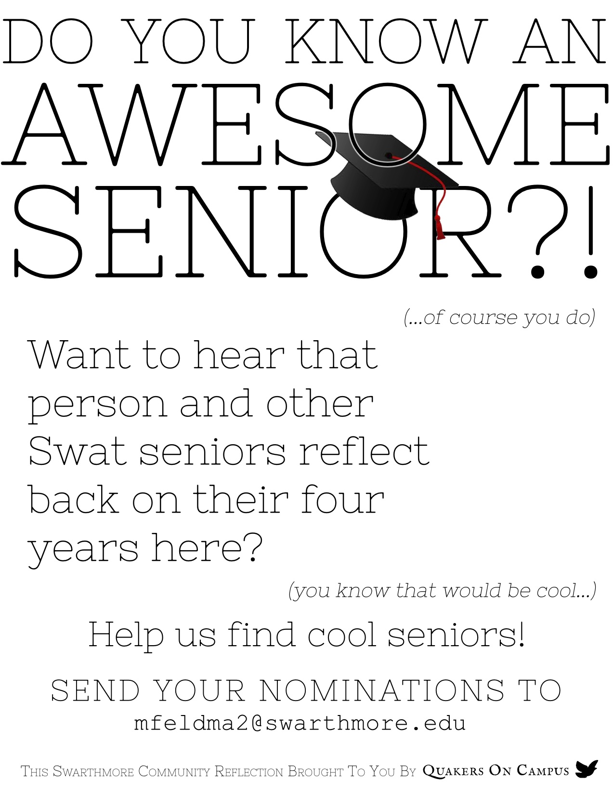

## I enjoy being creative.
I'm excited about photography, graphic design, and ceramics, but am open to all kinds of artistic avenues. Below you'll find some examples that I've done over the years, and some places to keep an eye on what I'm working on.

### Photography
I don't have a central repository for photos that updates frequently. I used to use [flickr](http://www.flickr.com/photos/acannistra) but have moved to [facebook](https://www.facebook.com/tony.cannistra/photos_albums) because it's proven to be more convenient. However, Flickr is starting to become appealing again. I'll probably switch back. In the meantime, here are some photos I'm happy with.

<small>The <a href="http://en.wikipedia.org/wiki/Pemigewasset_River‎">Pemigewasset River</a> in Woodstock, NH</small>

<small>Breakwater; Block Island, RI</small>

<small>A thunderstorm over Narragansett, RI</small>

<small>A closeup macro shot of a lily</small>

<small>a firework from the Cumberland, RI 4th of July festivities</small>

### Graphic Design
I dabble in design every once in a while, or when someone asks me to design something for them. Most recently I worked on a series of posters and a logo for Swarthmore College's "Quakers on Campus" group. They were looking for informative posters with a minimalistic design. Here are some of the results of that endeavor.

<small>a logo for Swarthmore's Quakers on Campus group</small>	

<small>a poster for QOC advertising weekly Quaker meeting</small>

<small>a poster for QOC advertising a senior community reflection</small>